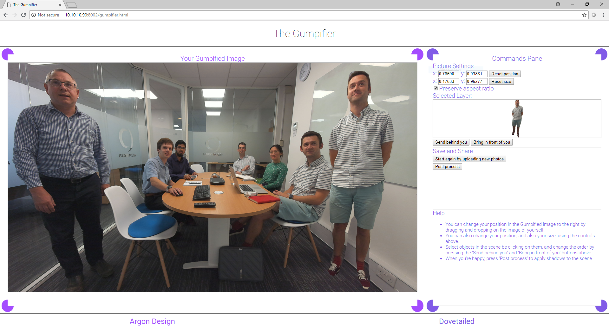
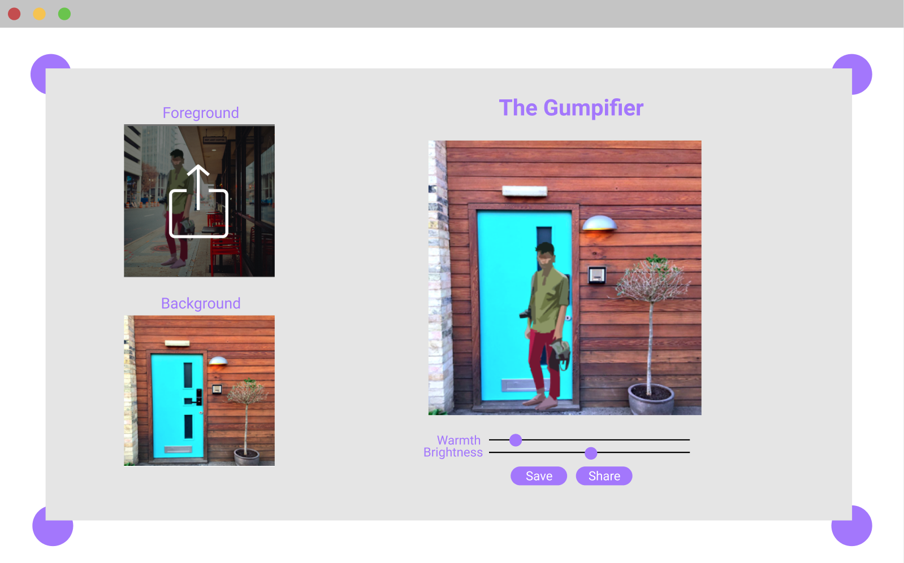
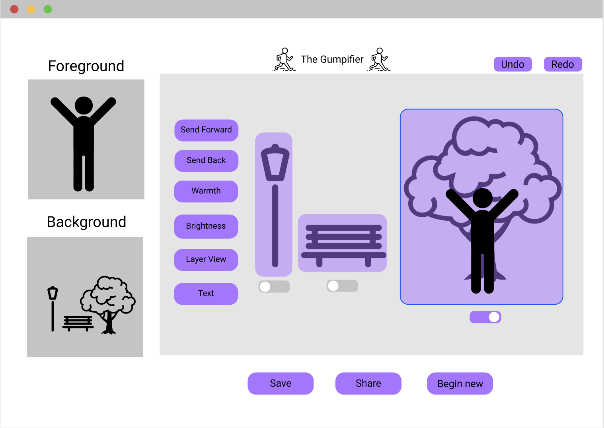
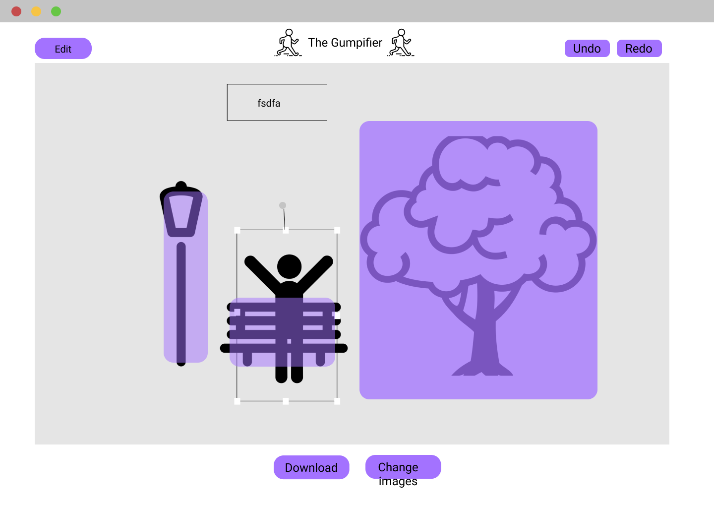

# User Experience -- Hai-Dao

## Vision

Create an interactive and fun application of Artificial Intelligence (AI) using cutting-edge techniques.

## Outcome

A collaboration between Dovetailed and Argon Design, The Gumpifier is an AI-powered tool that can transport you into any photo.

## Brief

The goal of a joint project was to use the strengths of Argon Design's software skill and Dovetailed's UX expertise to create an fun AI-powered tool informed by UX principles.  The idea for the Gumpifier was borne out of an interest in cutting edge AI research and a desire to make AI approachable and human-centred.

## Result

We can all relate to missing the family photo at a birthday or wishing you were on a cool holiday.

The Gumpifier is a website where you can insert yourself into any photo using advanced AI techniques.  The Gumpifier uses a Convolutional Neural Network architecture called Mask-RCNN to segment objects within provided images.  The provided foreground cutout is then refined using a series of algorithmic techniques to balance the colour and luminosity to the supplied background.  The entire set of detected objects, all of which are classified using the MSCOCO dataset, is then further analysed to determine the scaling and positioning of the person with respect to the background image.

## Process

After a joint brainstorm, we at Dovetailed began to research similar AI experiments and tools: Google's[library of fun AI experiments](https://experiments.withgoogle.com/collection/ai) was a great source of inspiration and fun around the office.  Argon Design provided a proof of concept which provided an idea of how the Gumpifier would function, however, the UI of the Gumpifier was far from decided. Our goals with the Gumpifier were to maintain a simple and playful UI that used familiar patterns and gestures.  The Gumpifier is a fun tool that shouldn't require a steep learning curve or loads of text to use.

We went through four iterations of the Gumpifier, using internal feedback for the initial designs and testing with real users for the final two iterations.  Interactive prototypes were especially helpful for testing, as whiteboard sketches don't have quite the same functions digital products do.  Even after the launch of the Gumpifier, we are still looking for user feedback and would love to hear what you have to say!

## User Experience of AI

AI is a hot topic that can garner reactions both positive and negative.  Rather than the dystopian view of AI as a tool to replace people and eliminate humanity, we believe in a user-centred AI that empowers human flourishing by automating the boring stuff and giving people time to solve the larger issues.  In the field of AI ethics, AI that cannot be explained is known as *black-box AI*.  Black-box AI gives us answers without being able to trace how or why it made the decision it did.

*User-centered AI* is AI that is explainable and seeks to enhance rather than replace humans. During the initial brainstorm for the Gumpifier, we sought to create something that used AI techniques without eliminating user control.  The Gumpifier depends on you for photo choices and allows users to edit the Gumpified image to whatever parameters they wish.  The Gumpifier is merely an assistant, making the process of editing people in and out of photos much quicker and simpler.  We have also included an explanation of what the Gumpifier does when it processes photos to keep users in the loop.  True user-centred AI is about thinking about the needs of users from the very beginning of a project and ensuring that humans are the ones who will benefit most from your use of AI.

DIRECTIVES: pictureGrid caption

*Figure 1: Our initial user interface, as designed by Argon Design.*

DIRECTIVES: pictureGrid caption

*Figure 2: The first iteration of The Gumpifier.*

DIRECTIVES: pictureGrid caption

*Figure 3: One of the many mock-ups of The Gumpifier.*

DIRECTIVES: pictureGrid caption clear

*Figure 4: The design that inspired the current design of The Gumpifier.*