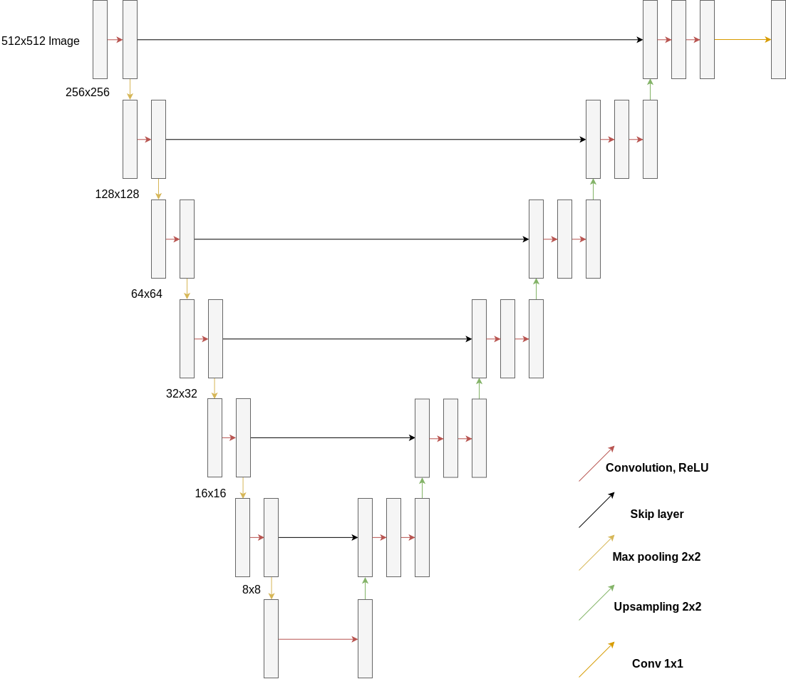

# Segmentation -- Mohammed

My part of the project focused primarily on the segmentation (cutting out) of humans from an image.  As mentioned previously, this project was constrained to use as much machine learning as appropriate.  Due to this, my first port of call was to gain a deeper understanding of convolutional neural networks (CNNs).  This was one of the current techniques for state-of-the-art image segmentation, as shown by recently published papers regarding models such as MaskRCNN and DeepMask, both of which scored very highly on benchmarks such as ImageNet.

Initially, I took a short online course to gain some knowledge on important concepts such as 'regularisation', 'gradient descent optimisers' and 'convolutional layers'.  This provided me with a baseline level of knowledge to design and develop a series of practice runs, the idea being to gain an appreciation of what factors can affect model architecture and accuracy.

Each toy program focused on a different image-related problem, such as the well-known 'MNIST' letter recognition problem and face recognition.  Working on small images with fewer features provided a much better starting ground than attempting to head straight to large images, as models trained and evaluated far faster.  This resulted in a short turnaround time between models and quickly gave me the understanding required to approach the larger problem of full image segmentation.

## Evaluating Various State-of-the-art Image Segmentation Neural Nets

I tried five CNN image segmentation implementations and qualitatively measured the performance and usability of each network for the given task.  This was not an in-depth study into their respective qualities, but instead acted as a bridge to design and develop my own, and hence quantitative data was not obtained (the papers contain sufficient quantitative data for comparison against the respective datasets).

My findings were as follows:

**DeepMask** ([Paper](https://arxiv.org/pdf/1506.06204.pdf), [Implementation](https://github.com/facebookresearch/deepmask)).  Deepmask performed well for the task at hand.  It extracted the instances of the objects correctly and provided the necessary labels for the project.  It does not run out of the box, but instead relies on NVIDIA libraries and graphics cards.  This wasn't a problem during testing due to the availability of sufficient equipment, but made it less suitable for the task at hand.

**SharpMask** ([Paper](https://arxiv.org/pdf/1603.08695), [Implementation](https://github.com/facebookresearch/deepmask)): SharpMask is an improved version of DeepMask.  It performed very well for the task, providing much sharper and more accurate results than DeepMask.  It is a little slower due to its higher complexity, but the difference isn't critical ($0.5$s on DeepMask per COCO image vs $0.8$s on SharpMask).

**BlitzNet** ([Paper](https://arxiv.org/pdf/1708.02813.pdf), [Implementation](https://github.com/dvornikita/blitznet)): BlitzNet, although fast, performed poorly in comparison with the other models.  It didn't perform very well in cases with overlapping objects, and didn't extract fine-grained information like MaskRCNN did.  It included far too much noise around the body for use in this project.

**CRFasRNN** ([Paper](http://www.robots.ox.ac.uk/%7Eszheng/papers/CRFasRNN.pdf), [Implementation](https://github.com/sadeepj/crfasrnn_keras)): CRFasRNN suffered similar issues to BlitzNet in that it performed poorly with overlapping objects.  It also produced a lot of jagged noise around the edges of the objects. 

**MaskRCNN** ([Paper](https://arxiv.org/pdf/1703.06870.pdf), [Implementation](https://github.com/matterport/Mask_RCNN)): MaskRCNN performed very well on the small sample set.  The implementation used here provided masks for every object, in addition to their bounding boxes, confidence and labels.

MaskRCNN was the model chosen for this project.  This was because there was already an accessible implementation in Keras, an excellent API, as well as very good existing results.  It also provided additional semantic information with the masks that others did not, giving space for more fine-grained analysis when computing parameters such as position and scale.

## Implementing the API: Colour Correction, Scaling, Positioning, Shadows and Refinement

At this point, we were approaching the halfway mark of our time at Argon Design.  The focus for me now was to implement the neural network and combine it with a series of graphics algorithms to produce an acceptable end result.

One goal for me was to design the API such that it was easily extensible, allowing future interns to customise how the software was computing parameters such as scaling.  Thus, each parameter's computation is self-contained, and the approaches I took are described below:

**Colour correction**: Colour correction was determined to play a key role in whether an image was suitably realistic.  My approach was to split colour correction into two key areas: luminance correction and white-balancing.

In order to correct luminance, it is important to understand what it is, as well as the factors that influence it.  Luminance is a measure of the intensity of light emitted from a surface per unit area.  However, this in itself would be an incredibly difficult measure to obtain, especially due to variations between monitors that would need to be taken into account.  Thus, it was best to focus on the concept of relative luminance, which would have a consistent yet noticeable effect on the users' perception of colour within the image.

As our computer screens display images using an RGB colour format, it was clear at this point that the various levels of each colour channel would be the controllable influences of luminance in the images.  However, the proportion that each channel influences the relative luminance is dependent on how the human eye perceives the wavelength of light emitted for each colour.  It turns out that green has almost double the influence of red as two out of every three cones in the eye have relatively high sensitivities to wavelengths commonly associated with green light.  Red has double the influence of blue for similar reasons.

As a normalised value to provide a standard measure across any set of images, I decided to use the vector $(0.299, 0.587, 0.114)$ (note the sum to 1) which was referenced in a document by w3 [here](https://www.w3.org/TR/AERT/#color-contrast).  To calculate the relative luminance value per pixel, each pixel would compute the dot product of its RGB vector and the above luminance vector.

My initial approach here was to take the average luminance vector of the entire background, and use that as the new luminance value.  This suffered from similar issues mentioned in Patrick's post, particularly those mentioned in the ski slope example.

I then decided that, given the knowledge of where the cutout of the person is, I can take the average luminance vector of the background pixels that are to be covered by the person.  This approach gave much better results due to better localisation, but still suffered from issues in extreme circumstances.

My third approach was to take the average luminance of the cutout, and then to take the average of that and the value of the local background segment and use that as the new luminance value.  This was significantly more successful, even in the average case, as it took into consideration the original lighting and features of the cutout too, as well as limiting any extreme values that could be held by either the background or foreground.

Having achieved a suitable luminance colour correction result, white-balance was then the next important metric to automatically configure.

**White balance** is the technique of adjusting the colour balance of light so that it appears a neutral white.  This is used to compensate for cases where there is something that would change the natural colour of objects, such as the yellowish colour of artificial light or a shadow from shade.

This colour balance is done on a per-channel basis, unlike the luminance value that uses a single scalar value to modify the entire colour.  It is often measured in Kelvin, a measure of temperature.  This temperature matches a colour output by a black-body radiator at that specific temperature.

The idea behind white balance algorithms is to sample a space that is known in the world to be a certain colour and modify the entire image such that the sampled area matches the known colour.  This requires an invariant that we couldn't satisfy; namely having an area of an image with a known colour.  This is because the images are being provided by a user with no additional contextual data that a device such as a camera would know when doing an internal white balance.

In order to match the white balance of the foreground with the background without the additional context, I first attempted to simply take the average colour of the background image and use that as the values for an algorithm that modifies the colour per-pixel.  This did not work at all, and instead provided an output that was completely white washed or completely blacked out.  This meant that certain colours were having a significant weight on the resultant value that needed to be accounted for.  

My solution to this problem was to determine the colours that provided these extreme values, and discard them.  To do this, I computed the values in the $0..5$ percentile range and those in the $95..100$ range.  I then clipped them from the respective colour channels, and finally took the mean.  This was vastly more successful, and was used in the final implementation.  From here, I took the three colour channel values that were returned and determined the colour temperature value by first converting the colour space from sRGB to XYZ, then to xy, and then finally used the Hernandez 1999 correlated colour temperature algorithm to produce a final result.

**Scaling:** In comparison to the colour correction techniques implemented, the scaling function is trivial.  I manually created a lookup table, where each cell contains a scaling factor that represents the average object's height (from Wikipedia) to the average person's height.  These map to the MSCOCO API lookup table of object names.  Objects that are to be ignored contain a value of zero as their scaling factor.

**Positioning:** The general idea behind the repositioning algorithm is to choose a random object and place the person in front or near that object.  

Here I use a custom weighted distribution to determine which object to place the person around.  This distribution is generated by computing the softmax of a list containing the sizes of all the objects within the image (which can also implicitly give information about the depth of said object within the image).  This gives a random variable that can be sampled to obtain the ID of the object.

Once we have the random object, we determine its location in the image and scale the person to be the correct size.  We then place the person a few pixels below the centre of the object to provide a more realistic look.

If the random object selected is a human, the algorithm instead tries to place the person around the object instead to avoid obscuring those within the image which in turn provides an automatic way of adding those not present to important photos like a Christmas family reunion.

The method used here is to continuously sample the various bounding boxes with which the sampled object shares a horizontal plane.  It starts by sampling to the right, trying to find a gap between two neighbouring bounding boxes that can fit the person in.  If there is none to the right, sample again from the object but instead going left.  If there is still none, slot the person right next to the left edge of the image.

**Shadows:** Research also suggested that shadows play a critical role in determining whether an image looks realistic.  However, shadows had to be implemented correctly otherwise they would instead have the opposite effect: making the resulting image look completely out of place.  Unfortunately, my attempt at shadows was not realistic enough for it to be used in the final product, primarily because the position of the shadows did not match up with the lighting.  The semi successful approach I did take is detailed here for the sake of completeness.

The idea was to use a perspective transform of the cutout to generate the shadow.

The first step was to generate an entirely black copy of the cutout.  As shadows are not completely uniformly black, I applied a continuous (modelled as a stepwise function with a change small enough to appear continuous) transformation to the cutout based on its y-coordinate to achieve a fade effect.  This transformation used a computed value of $\frac{255}{75\%}-height$ to determine the change of colour between the y-values.  This was then applied to the cutout, and achieved a result such that the bottom $25\%$ was a sharp black, and the shadow became increasingly lighter as the y-value increased.

I then had to perspective transform the shadow so that it would appear to be lying on the ground.  This was done by generating two points in a new plane, each of which was created by rotating a respective top point on the current plane by an arbitrary factor, then diagonally stretching them by an arbitrary factor, and finally translating them each again by a set of arbitrary coordinates.

Finally, as shadows are soft in the real world, I applied a series of Gaussian blurs on the shadow to provide a soft looking result.  This, like the fade effect transformation, was done using a stepwise transformation that progressively made the shadow softer as you venture up the image along the y-axis.  This was done after merging the shadow with the background image as that captured the underlying colour of the scene in the blur.

Another approach I took to creating shadows was generating a shadow map using an artificial scene and ray tracing.  As there is no depth information and both the scenes and foreground are 2D, this did not work despite approximating the dimensions of a person.

**Refinement:** The resulting cutout of the person from the neural network was not perfect.  The neck area in particular majorly suffered from poor bounding as the network would include a large chunk of surrounding background here.  To overcome this, I attempted to refine the image using an algorithmic approach.

The algorithmic approach uses the idea that the person is distinct from the background.

We generate a weighted graph of the image where each pixel is a vertex, neighbouring pixels are joined by an edge, and the weight of each edge is the difference of a function of the colour of each pixel.  We then run a variation of Kruskal's algorithm that connects two edges if and only if the edge weight is below a predefined threshold.  This gives multiple trees, each of which have the property that all vertices have a similar colour.  Here we assume that the background has a uniform colour scheme so that we can then filter out all pixels of a weight below a threshold defined as a function of all the weights in the largest tree.  

This worked extremely well when we used a test case of a person against a bright green screen.  However, in practice the two assumptions made (the background being distinct from the person and the background having a uniform colour scheme) do not hold, and thus the algorithm fails to extract anything useful.  The threshold is also difficult to compute - a manually assigned threshold worked very well for the green screen case, but generating the threshold from the weights themselves proved to be unsuccessful.

## Designing a New State-of-the-art CNN to Segment Humans

Having had about nine weeks of hands-on experience with machine learning models and some background reading of various papers on the area, I started designing and developing a machine learning model with a goal to outperform MaskRCNN on segmenting humans from the image (a subset of the task that MaskRCNN was designed to do).

## Building the training set

The first task in creating the model was to clean up the dataset that I was using.  The data fed in for predictions (supplied by an end user) would be a single three-channel (RGB) image containing a human figure.  

The MSCOCO dataset contains a large number of images from 80 categories. This was a superset of all the images I needed to train on. Due to processing and time constraints, it was necessary to filter out unrelated images. 

I used the following pipeline process for working with this dataset:

<ol>
    <li>Use the Python COCOAPI to match labels to images and extract an image list of only those that contained labelled human figures.</li>
    <li>Use Pillow to determine the number of channels in each image, discarding those that have fewer than three channels. In the case of four-channel images, use OpenCV to flatten the alpha channel.</li>
    <li>After a few trial runs of the model below, I also filter images out that don't contain prominently placed people within the image (measured at about 20% of the total image size).</li>
    <li>Create a <code>DataGenerator</code> class (a subclass of <code>keras.utils.Sequence</code>) which acts as a generator, yielding processed images in a random order and masks to the consumer. The processing includes resizing all images and masks to a consistent size (512x512) and applying random transformations including horizontal flips, random crops, gaussian blurs, contrast normalisation, gaussian noise and random colour correction to each channel and affine transforms such as scale, rotation and shear.</li>
    <li>Plot the images and masks using matplotlib. This helps identify any processing errors made in the above steps.</li>
</ol>

## Model design and outcomes

The model I designed was based on a UNet ([Paper](https://arxiv.org/pdf/1505.04597)) architecture, due to its simplicity and prediction speed. The model uses a series of convolutional, skip, max pooling and up-sampling layers to generate a per-pixel probability map. The architecture is shown in the diagram below: 

DIRECTIVES: fullWidth

The number of filters on the convolutional layers is constant along each row, and increases by a power of two as the image size decreases.

My loss function for this model was the binary cross entropy of the result and mask summed with the dice coefficient.  This is very similar to the Mean Intersection over Union (MIoU) measure used in a wide variety of papers, but penalises a single bad output less than a MIoU metric would. 

Also included is an early stopping mechanism to prevent overfitting. This stops training if the loss does not decrease by at least 0.0001 in two epochs.

The results for this are as follows: 

<table>
  <tr>
    <th>Model parameters </th>
    <th>Dice Coefficient</th>
  </tr>
  <tr>
    <td>512x512, starting at 4 filters</td>
    <td>0.53</td>
  </tr>
  <tr>
    <td>512x512, starting at 8 filters</td>
    <td>0.59</td>
  </tr>
  <tr>
    <td>512x512, 32 filters</td>
    <td>0.67</td>
  </tr>
  <tr>
    <td>512x512, 64 filters</td>
    <td>N/A, out of memory </td>
  </tr>
  <tr>
    <td>512x512, 32 filters, Dropout</td>
    <td>0.73</td>
  </tr>
  <tr>
    <td>1024x1024, 16 filters</td>
    <td>0.65</td>
  </tr>
  <tr>
    <td>1024x1024, 16 filters, Dropout</td>
    <td>0.69</td>
  </tr>
  <tr>
    <td>256x256, 64 filters</td>
    <td>0.64</td>
  </tr>
  <tr>
    <td>256x256, 64 filters, Dropout </td>
    <td>0.71</td>
  </tr>
</table>

Note that the results may be different on future runs of the same architecture due to the randomisation of transformations and order. These are single run results, not averages.

## Thoughts and lessons learned

Although some of the models had good dice coefficients, there was a fundamental problem with all the results that the models were producing.  Although the outline of the person was somewhat clear, there was a large gap missing within the person's body.  The position of this gap was random, based on the properties of each image.  This meant that the model was not suitable yet for use in the project, as realism dictates that it's better to have slightly too much of the person and their background than a gaping hole in their body.

A few things I'd do differently if I were to design a neural network model for a similar project:

<ul>
	<li>Don't train on the test set! Despite it being one of the core mantras in developing models, it is far too easy to accidentally let features from the test set be implicitly learned by the model.  This can arise from playing around with hyper parameters and changing them such that they increase the test set score.  I realised this was happening a little too late in model creation, and as a result it caused a lot of overfitting.</li>
	<li>Select a series of transformations that are more appropriate to the use case.  It's unlikely you'll ever have a supplied image of an rotated and distorted human (although in the case that you do, the more generalised model will be able to somewhat cope).  This is a case for trading generalisability for performance in a specific case.  This goes slightly against the mantra of not overtraining a model.  It all comes down to the use case of the model.</li>
	<li>Try a considerably larger number of architectures.  There's a somewhat large amount of hyperparameter and layer guess work when designing these models, and so it's important to try a number of architectures to see which models capture the data in the best way possible.</li>
	<li>Play around with a custom dataset if possible.  This is probably the most difficult task.  Creating a sufficiently large dataset takes up a large amount of time and resources that aren't always available.  The issue with the MSCOCO dataset is that the images and masks themselves had jagged areas around the neck.  These jagged areas were a primary reason for attempting to build a model that can correct for them.  The premise is flawed however when the model is learning data with that feature.</li>
</ul>

