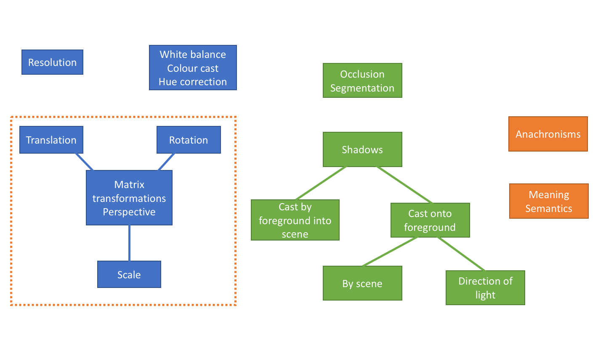
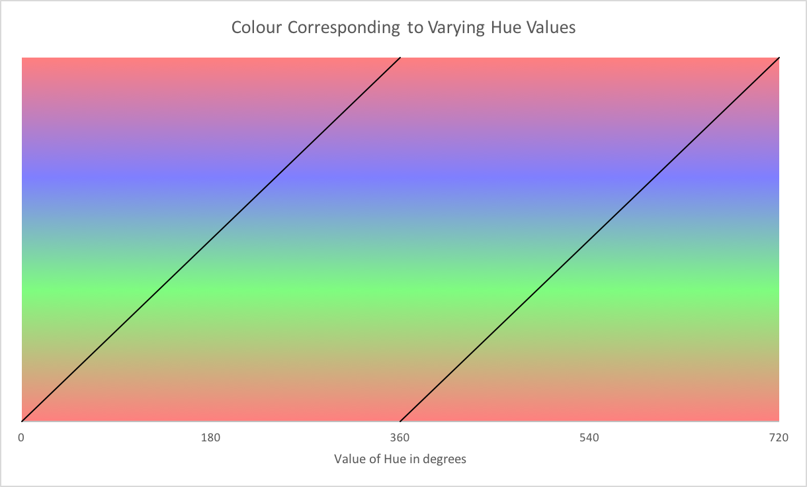
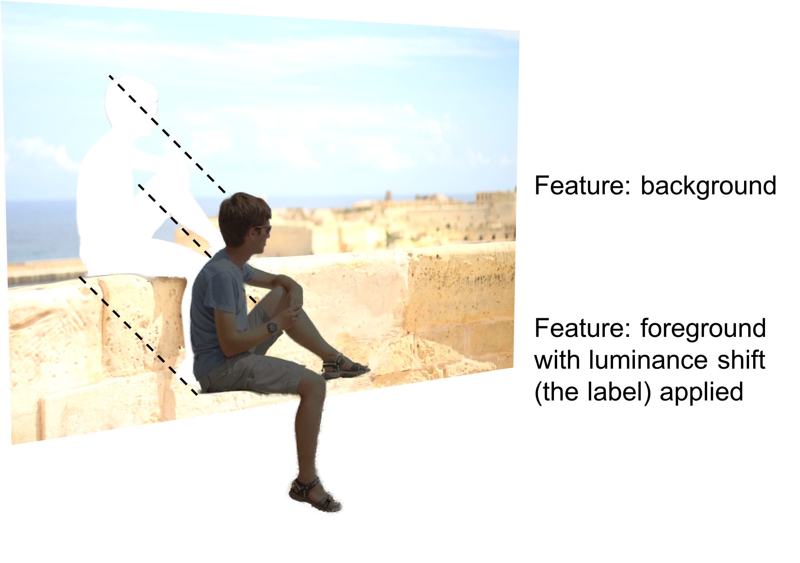
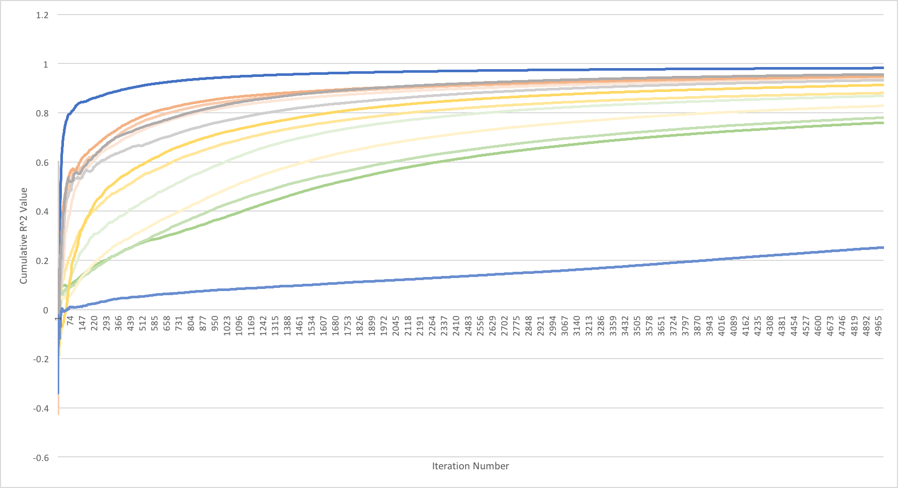
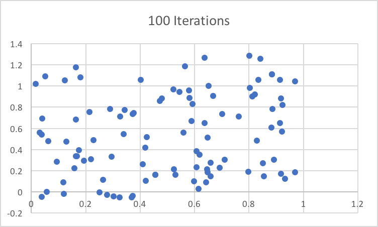
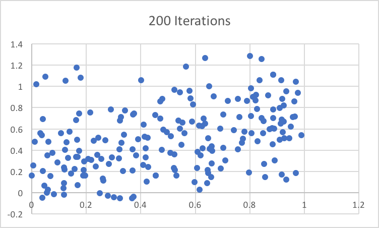
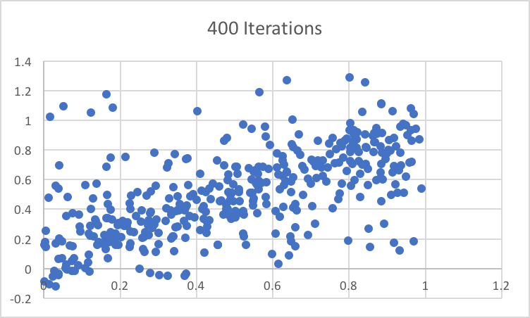
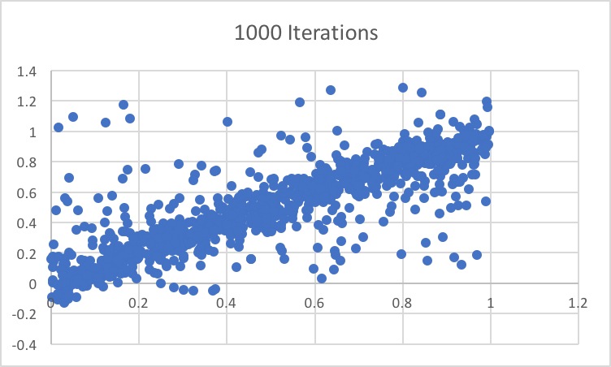

# Patrick -- Argon Design -- Colour Correction

## Introduction

*&ldquo;The Gumpifier will allow the user to input an image of themselves, along with a photo of a background scene, and it will automatically insert this image into the scene in a realistic manner&rdquo;*.  Over my few weeks of interning at Argon Design, I had become well practised at explaining this brief to colleagues and relatives alike.  Our remit posed an interesting problem: it was naturally and intentionally open-ended; it was defined only in high level natural language terms; there was no obvious starting point or success criteria.  Our only constraints were that we must use Machine Learning (ML)/Artificial Intelligence (AI).

Our first port of call, having completed some crash courses in standard ML techniques and libraries, was to brainstorm areas which we thought feasible given our time constraints and resources.  We came up with the following:

DIRECTIVES: fullWidth

*Figure 1: The blue boxes indicate slightly 'easier' areas.  The green boxes show areas which we anticipated would cause us more problems, and the orange boxes indicate topics we thought could be very difficult.  The orange line around some of the blue boxes hints that, although it is trivial to apply matrix transformations to an image, knowing which transformations to apply could be tricky, and may have to draw on themes from the orange boxes.*

The most prominent aspects of the figure related to the positioning of the foreground image.  This included translation, scale, rotation as well as segmentation (automatically cutting out the picture of the person in the foreground from the background against which they were taken).  In another section of this post Mohammed, the other Argon intern, describes how he went about tackling these areas, however my task related to the top right blue box: colour correction.

## Hue Correction

The term 'colour correction' seems to be wide-ranging and encompass many areas.  I started working on the 'hue' channel of a Hue-Saturation-Lightness (HSL) colour space.  This seemed like a good idea at the time for a couple of reasons:

<ol>
    <li> It seemed sensible to work with images in a colour space which has some physical meaning.  Practically, this meant working in HSL or Hue-Saturation-Value (HSV).
    </li>
    <li>Tensorflow had some very tempting built in functions with names like <code>adjust_hue()</code> and <code>rgb_to_hsv()</code>.</li>
</ol>

Thus, I began, naively, to construct a convolutional neural network (CNN) which attempted to predict the correct shift in hue to apply to the foreground to make it match the background.

Unfortunately, it did not.  In fact, the predictions consistently collapsed to a mean value, taking no account of the contents of the inputs.

The most sensible debugging route seemed to be to build up from a similar toy CNN and to find the point at which it had failed.  This took the form of attempting to perform similar hue correction of a single, randomly coloured pixel to another one, then building up to a 2x2 pixel block, then 4x4, and at some point, switching to photographic, not random, data.

The debugging worked.  Unfortunately, it highlighted the inevitable failure of working on 'hue correction'.

Let's think about the three channels with which we're working: hue, saturation and lightness.  Conceptually, saturation and lightness are both linear scales, ranging from, say, 0 to 255.  Hue is different.  Hue is a 'circular' scale.  We often think about it in degrees, where $0^{\circ}$ is red, $120^{\circ}$ is green and $240^{\circ}$ is blue, before we wrap round to red again.  This creates a discontinuity whereby the same colour is represented at $20^{\circ}$, $380^{\circ}$, $740^{\circ}$, ..., for example.

DIRECTIVES: fullWidth

*Figure 2: Multiple distinct values of hue map to the same colour.*

This is not an easy function for a neural net (NN) to learn.  We can conceive of an architecture which should learn such a modulo function, or we could implement the modulo in the loss function itself, removing responsibility from the NN, but nothing seemed to get around the inherent problems caused by the discontinuity.

The neural net does makes a passable attempt at predicting what hue shift to apply to correct a foreground at values far from the discontinuity, but starts to break down close to it.

We also start wondering if applying a uniform shift in hue to all pixels in the foreground is really a sensible thing to do.  Simply rotating the hue of each pixel is, perhaps, an unusual situation to have to correct, and is not necessarily the same as a related, and more common correction, that of removing a colour cast, which is more in the domain of white balance.

## Luminance Correction

With this in mind, I moved onto a more promising line of enquiry: luminance correction.  This seemed a more realistic goal both on a conceptual level (it is often obvious when the foreground is too dark or too light) and a practical level (the discontinuity of the modulo function present in hue correction no longer applies).

This time, I began tentatively, building up from the simple problem of matching the luminance of two randomly generated pixels to those of large images.

Unfortunately, a different set of problems soon arose, this time, due to limitations in the training datasets I used.

## Datasets

Consider the ideal dataset for training.  Each example would comprise:

<ul>
    <li>Feature: A picture of a background scene.</li>
    <li>Feature: A picture of a person in different lighting, along with a mask indicating where the person is.</li>
    <li>Label: The same person, in the same pose, inserted into the background scene, with everything else the same, except the luminance of the person has been corrected.</li>
</ul>

This dataset does not exist.  It is unlikely to in the future, and we did not have the time or resources to produce it.

A dataset that does, however, exist, is the second bullet point above: a dataset of pictures of people with their associated masks.  This I modified to try to fit our purposes, giving the following dataset:

<ul>
    <li>Label: a randomly generated float representing a shift in luminance.</li>
    <li>Feature: cut out of the person with the luminance shift applied.</li>
    <li>Feature: the remainder of the image from which the person has been cut out.</li>
</ul>

DIRECTIVES: fullWidth

We try to train the network to predict the label value given the background and the luminance-shifted foreground.

We might hope that the neural net somehow learns to match the luminance of the foreground with the background.

We hope in vain.

Consider, for a moment, the following example.  We have a picture of someone with skis, and are trying to insert them into a picture of a snow-covered ski slope.  This throws up a whole tranche of questions and problems:

<ul>
<li>A naive approach would slam the luminance of the foreground up to a high value because of the brightness of the white snow behind.  But what if the skier is wearing black clothing?  This would be an inappropriate correction.</li>
<li>How do we know if the skier is wearing black clothing?  He may be wearing grey, or even white clothes, but the photo is horribly underexposed.  To better gauge the overall exposure of the foreground, we would need its surroundings: impossible from our modified dataset as we already use the surroundings as the background image!</li>
<li>What if the skier is wearing black trousers and a white top?  What is the most appropriate luminance shift to apply?  Should we apply a single value across the whole foreground or multiple values?</li>
</ul>

These are questions which a human may find difficult to answer, given the same dataset, so it seems unreasonable to expect a neural net to learn effectively.

Indeed, the effect of the last bullet point was a first-rate example of something going wrong when we tried running the trained network on practical examples.

## Deception

The problems above may appear obvious, but it took some time to arrive at the reasons for the networks' failures.

In the early stages of developing the toy networks operating on a single pixel of data, I was very keen to track the progress of the network whilst it was training to ensure it was heading in the correct direction.  This led to a series of graphs such as the following:

DIRECTIVES: fullWidth

Each line on the graph represents a different network architecture or variation of training data.  This shows, on the x-axis, the iteration number during training, and on the y-axis, the average $R^2$ correlation value between predicted luminance shifts and the actual luminance shifts (the 'labels') for all values so far in the training.  To unpack that a bit, take a look at these four graphs of predicted values against the label values at various stages throughout training:

DIRECTIVES: pictureGrid

DIRECTIVES: pictureGrid

DIRECTIVES: pictureGrid

DIRECTIVES: pictureGrid clear

We see that, near the beginning, there is little correlation between the two, but as training goes on, the correlation, and thus the $R^2$ value, as hoped for, increases.  This is reflected in the above graph which, even for the complex examples of real life images, often reached $R^2$ values of $>0.8$, which seemed perfectly reasonable.

So how does such close monitoring result in poor results on a valuation or test set?  If you've read this far, you probably know the answer already: overfitting.  It would have been sensible to implement a second piece of monitoring: a graph which shows the accuracy of the network used solely for prediction on a set of images not used for training.  It is when *this* graph begins to level off, or decrease, indicating that no more generalisable learning is taking place from the training set, that the training should be stopped.

## Future Work

Overall, trying to train a neural network to perform colour correction with the datasets we had did not work.  After a few weeks of attempts, I moved on to working with Dovetailed to implement the user interface, in the form of a web app, and some server-side code.  In the end, some colour correction functionality was implemented using standard algorithmic techniques, and not artificial intelligence, as described in Mohammed's section.

I believe, however, that there is still hope.  It may be possible to apply other techniques in AI to achieve our desired result.  Perhaps taking in more of the semantic meaning of the images used in a dataset could be utilised by the network: one paper to which we referred used this technique in other areas of colour correction.  Another promising lead would be to use the recent development of 'Generative Adversarial Networks' (GANs), which have had startling success in many areas of AI image processing.