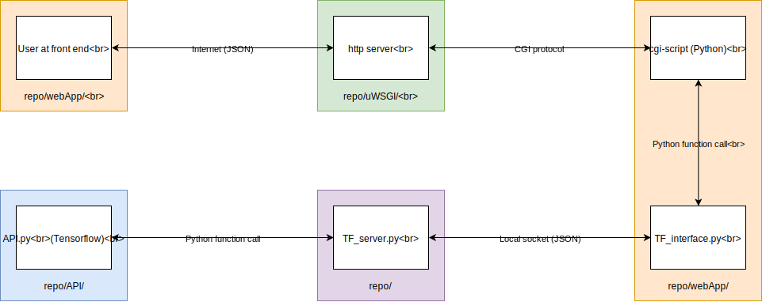

## Webapp

## Context

This folder contains code for the frontend (HTML, CSS, JS), the CGI scripts (PY) and an interface mediates between the CGI scripts and the Tensorflow server.  I.e. the orange boxes in the diagram below.

## Terminology

* The front end behavior is divided into two parts: 1) the user selects their images; 2) the user edits the suggested composition.  We call these two states 'screen 1' and 'screen 2'.
* The image of the person, which has been automatically segmented and inserted into the scene, we call the 'foreground'.
* Each of the objects which have been segmented from the original background image the user provided we call 'background images', 'background segments', or similar, no matter if they are placed in front of, or behind, the foreground.
* The original background picture the user uploaded is displayed behind the foreground and other background segments, we call it the 'very background' image and it has the html id "first".

## Files and directory listing & How to navigate the code

### Folders

* `cgi_bin/` - the Python CGI scripts and TF_interface.py
* `jquery-ui-1.12.1.custom/` - a custom download of JQuery UI with draggable() and resizable() included.
* `SharedResources/` - contains example images, icons and logos
* `storage/` - contains user uploaded content

### html

- `gumpifier.html` - the base html file for the webApp.

### css

Layout and style are separate for both screen 1 and screen 2.

- `gumpifierLayout.css`
- `gumpifierStyle.css`
- `screen2Layout.css`
- `screen2Style.css`
- `rangeStyle.css`

### js

A good way work out what happens when the user presses a button or another event occurs is to work from the top level downwards.  Most event bindings for button clicks, slider changes, key presses etc. are in `eventHandlers.js`.  From here you can find the function that is called - often in `topLevelEventFunctions`.  This will then direct you towards the main implementation.

Some functions are not bound in `eventHandlers.js` - notably ones which relate to dynamically created elements (e.g. drag and resize events for the foreground and meme textarea).

Most js files contain an extended comment at the start with an index of functions contained in them and a brief description of each.

**Both Screens**

* `eventHandlers.js` - binds many events to functions.

**Screen 1**

* `stateTracker.js` - tracks what state screen 1 is in an sets which animations are enabled/disabled as well as if the Gumpify button is enabled/disabled.
* `animation.js` - controls the actual animations.

**Screen 2**

* `topLevelEventFunctions.js` - many of the functions which are bound in `eventHandlers.js`.
* `functionality.js` - some heavy lifting functions called by or bound in `topLevelEventFunctions.js`.
* `colourFunctions.js` - functions and state relating to foreground colour correction.
* `undo.js` - functions and state relating to the undo manager.

**Third party**

* `html2canvas.js` - used for rendering the meme text onto the final image to be downloaded.
* `jquery.ui.touch-punch.min.js` - used to convert click events to touch events for use on mobile devices.

